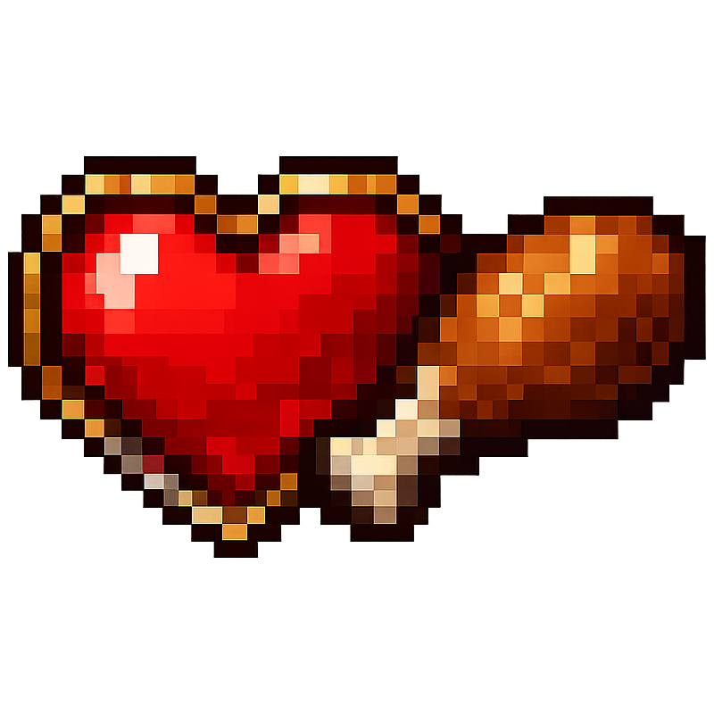

# Shared Life

Makes all players share one health bar. When one player takes damage, it affects all players in the world. The intention is to create a challenging multiplayer experience where players cooperate to survive (or blame each other for their deaths). Ideally paired with hardcore mode.

Natural regeneration is a group effort: the shared health only regenerates while *every* player is fed. This means a single player can't sit in safety and eat the group back to health while others are in danger.

### Features
- Shared health bar.
- Natural regeneration requires the whole group to stay fed.
- Announcement in chat when someone takes damage, including amount and source.
- Damage summary in chat when the shared life ends, showing how much damage each player took since it was last at full health.

### Optional Features (off by default)
- Shared hunger bar.
- Shared experience.
- Sharing death only: one player's death kills everyone, without sharing health.

